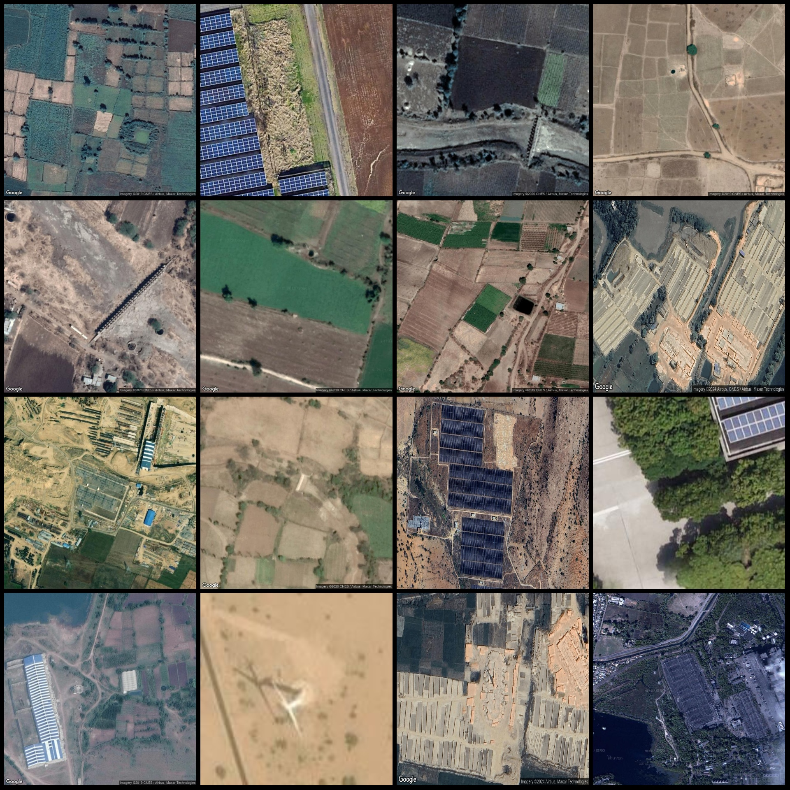
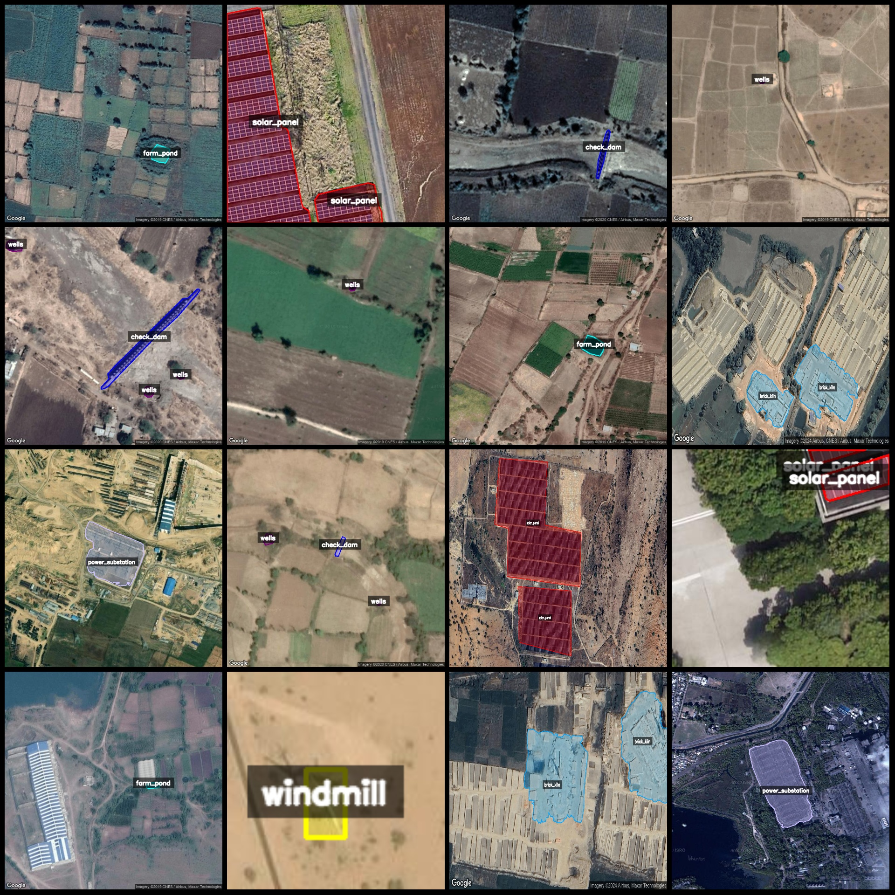
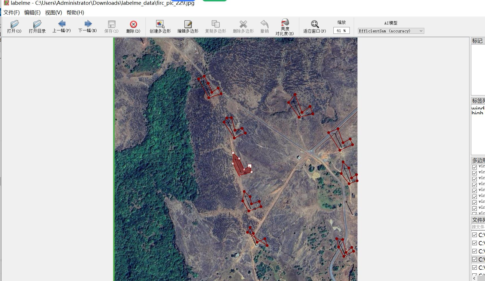

# Remote Sensing Image Dataset for Classification and Segmentation of Ponds, Substations, Towers, Brick Kilns, Solar Panels

The following is the label information for the Remote Sensing Image of Pond Substation, Electric Tower, Brick Kiln, Solar Panel Recognition and Segmentation Dataset:

1. brick_kiln
2. check_dam
3. farm_pond
4. high_tension_tower
5. power_substation
6. solar_panel
7. wells
8. windmill
9. water_well
## Images

Here is a pay link on Stripe ( https://buy.stripe.com/3cs8yP7sY87d0vu9AB ). Please contact me lonlonago@foxmail.com after funding $89, and I will send you a complete data files , thank you!

